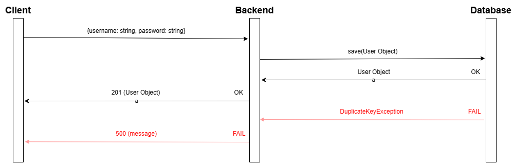
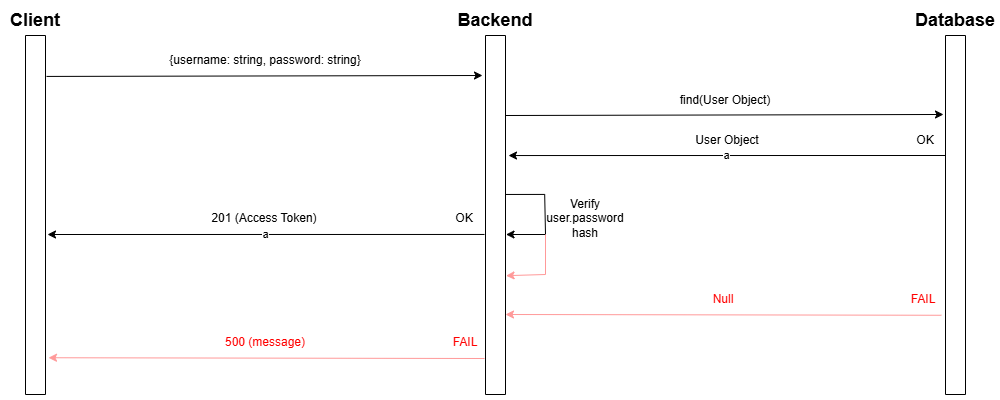

# Password Manager

This application is a password manager, that encrypts and decrypts passwords that are stored in the backend.
## Tech Stack
* Frontend - Angular 18.
* Backend - NestJS 10.
* Database - Postgresql
## Local Deployment with Docker

To deploy the code locally, navigate to the root folder of the project and run the command:

```
Docker compose up
```

*Note: Docker daemon must be running to run the command.*

The application is deployed to **http:/localhost:4200**.
## Security Model

The security model of this system can be broken into two parts; the login & registration and storing passwords (the core functionality of the application).

### Login & Registration

For registering, the application uses Bcrypt to hash the user password, Bcrypt is used to verify the user password when a login attempt is made. If the user is found in the database and the password is verified, a JWT bearer token is returned with the user object. This JWT token is used to protect other end points in the backend and is written with a secret key which is used for varification of the JWT token.

#### Registration Flow



#### Login Flow



### Storing passwords

The passwords that are stored in the backend are encrypted rather than hashed because it needs to be reversable. When developing this application, it was important to keep the means of decrypting a password and the means of getting them seperate. In other words, we did not want the backend to take part in encrypting or decrypting the passwords. This way, if a backend breach is made, the passwords are safe because they are encrypted, so while a threat actor may be holding the encrypted passwords they do not hold the means to decrypt them.

In the frontend, the password is encrypted when creating a new password for the vault using AES with the user's hashed password as the encryption key. The password is hashed using Argon2. This encrypted password is what is passed to the backend.

The hashed value of a user's password is saved in session storage, to limit the scope of persistence. This makes sure the key is flushed, when the browser is closed.

#### Password Storage Flow

